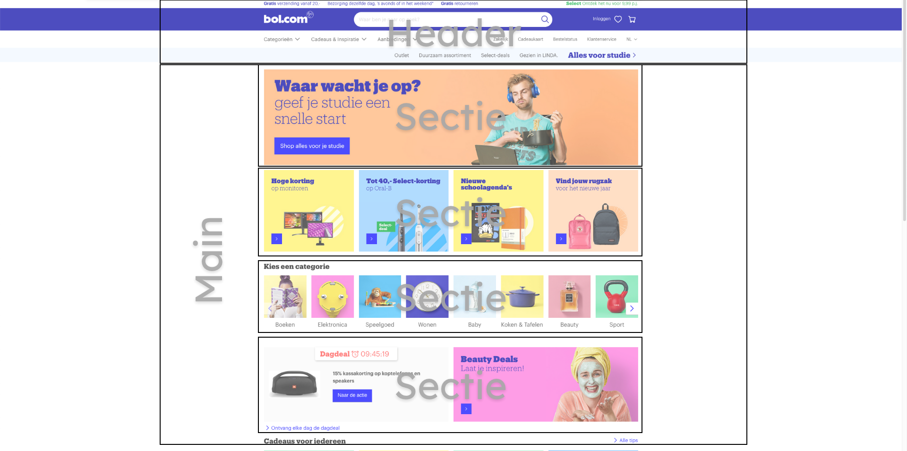

# Procesverslag
**Auteur:** Djescho

Markdown cheat cheet: [Hulp bij het schrijven van Markdown](https://github.com/adam-p/markdown-here/wiki/Markdown-Cheatsheet). Nb. de standaardstructuur en de spartaanse opmaak zijn helemaal prima. Het gaat om de inhoud van je procesverslag. Besteedt de tijd voor pracht en praal aan je website.

## Bronnenlijst
1. -bron 1-
2. -bron 2-
3. -...-

## Eindgesprek (week 7/8)

-dit ging goed & dit was lastig-

**Screenshot(s):**

-screenshot(s) van je eindresultaat-

## Voortgang 3 (week 6)

-same as voortgang 1-

## Voortgang 2 (week 5)

-same as voortgang 1-

## Voortgang 1 (week 3)

### Stand van zaken

-Ik ben ontzettend blij dat ik de bol.com website heb uitgekozen voor deze opdracht. Ik vind het een ontzettend leuke uidaging om aan te gaan. Wat de bol.com site uniek maakt is dat de site ontzettend veel horizontaal scrollende velden heeft. Dit was een ontzettende uitdaging: hoe plaats je de navigatie pijlen?, hoe zorg je er voor dat tekst en afbeelding netjes bovenelkaar blijven staan? Dit waren allemaal vragen waarvoor ik het antwoord moest opzoeken. Na veel getest en nieuwe code heb ik het bij sectie 2 erg netjes gedaan.
Het leukste vind ik het netjes maken van mijn HTML/CSS. Ik vind het een hele leuke uidaging om mijn HTML en CSS zo goed mogelijk te optimaliseren door bijvoorbeeld: globale classes op te stellen, css selectoren te gebruiken en speciale afbeeldingen (zoals iconen) een speciale class te geven.-

**Screenshot(s):**

(./images/proces/voortgangWeek3.png)

### Agenda voor meeting

-samen met je groepje opstellen-

### Verslag van meeting

-na afloop snel uitkomsten vastleggen-

## Intake (week 1)

**Je startniveau:** Rood. Ik vind programmeren erg leuk en ik begrijp het ook meestal snel.

**Je focus:** Responsive. Ik vind dit nog een uitdaging bij het bouwen van websites dus ik denk dat dit een goede keuze is.

**Je opdracht:** https://www.bol.com/nl/

**Screenshot(s):**

(./images/bolFooter.png)

**Breakdown-schets(en):**

