# Procesverslag
**Auteur: Djescho**

## Bronnenlijst
1. Iconen van https://www.flaticon.com/-
2. Alle (product)afbeeldingen van https://www.bol.com/-
3. Bol.com logo van https://pers.bol.com/beeld-archief-item/bol-com-logo/-

## Eindgesprek (week 7/8)

De laatste loodjes wogen voor mij het zwaarst. Ik kwam er achter dat er nog best wel wat bugs in de site zaten die me niet waren opgevallen, en die niet zomaar 1, 2, 3 waren opgelost. Dit was dan ook soms erg frustrerend. Ik ben in dit project voor het eerst gaan werken met svg's en wat een nachtmerrie. Omdat ik eerst niet begreep hoe ze werkte heb ik flink wat svg's in img tags geplaatst. Uiteindelijk ben ik naar svg's als elementen plaatsen overgegaan, waardoor er soms nog in de code img tags zitten met daarin een svg. Dit is ook de rede van de vele foto's in de 'img' map. Ik ben er helaas niet aan toegekomen om dit 100% netjes te maken.

Uiteindelijk heb ik besloten om de klantenservice pagina als pagina 2 uit te werken. Eerst wilde ik de product detail pagina uitwerken, maar deze bleek nog veel ingewikkelder in elkaar te zitten dan de homepagina. De items staan in grid uitgelijnd, waarbij ze op de mobiele versie naar een één kolom's weergave gaan. Het probleem hiermee is dat de items op een andere volgorde terecht komen binnen het grid en dit kreeg ik niet voor elkaar. Ook zit er een lightbox in deze pagina, maar de code die ik hervoor had gevonden begreep ik niet en werkte niet.

Na veel geploeter mag het eindresultaat er zeker wezen. Ik heb meerdere keren gehad dat ik mijn versie van de bol site verwarde met de echte versie. De site is 100% responsive vanaf 320px. Ik ben ontzettend onder de indruk van mijn eigen opgebouwde skillset en het resultaat dat er uit is gekomen. Het beste was toen ik eenmaal doorhad hoe ik secties super snel in elkaar kon zetten, omdat de css die ik schreef steeds beter begon te begrijpen.

Nu de site af is heb ik even kritisch naar mijn code gekeken en ben ik een aantal verbeterpunten gevonden, die ik mee neem naar mijn volgende project. Deze heb ik hieronder beschreven.

  Analyse

Door de volgende keer een website beter te analyseren hoop ik sneller overeenkomsten te vinden tussen verschillende secties. Nu heb ik heel vaak dezelfde stijl in verschillende secties toegepast, terwijl dit simpelweg ook met een class kan. Ook had ik dan een veel beter beeld kunnen krijgen van de verschillende soorten headings. Omdat ik alles al zo ver ingecodeerd had, heb ik best vaak headers moeten overschrijven in css met een andere stijl.

  Van boven naar beneden werken

Door mijn enthousiasme ben ik de site vrij chaotisch begonnen. Zo had ik eerst de header af op mobiel, toen ging ik door naar 2 sections in de main, toen half aan de footer begonnen, kortom het ging niet heel geordend. Toen ik dit op de tweede pagina wel ging doen ging het coderen een stuk sneller en efficiënter.

  Afbeeldingen

Ik moet heel strak aanhouden dat ik voor iconen svg's gebruik en dat ik geen svg's in img tags ga plaatsen.

  Media queries

Omdat ik zo chaotisch te werk was gegaan stonden mijn media queries overal. Het beste werkt als je de media querie direct onder een sectie plaatst om alles netjes overzichtelijk te houden. Dit heb ik voor 90% kunnen fixen in mi css, maar alleen de footer staat een beetje apart aangegeven.

  links en buttons

Ik was vergeten om in heel veel list items a tags te zetten waardoor de website eerst niet navigeerbaar was. Dt is nu opgelost, maar zorgde voor de nodige frustraties en moeilijkheden met css. Ook was ik vergeten om states aan links en buttons te geven, maar dit is inmiddels opgelost

Ik heb dit vak als ontzettend leerzaam en leuk ervaren. Ik heb het gevoel dat ik een stuk meer weet, en mijn kennis beter kan toepassen. ik wil hierna ook graag blok tech gaan doen en a, ook ik heb nu een klein schetsboekje om containers in uit te werken..

over github: Er is iets niet helemaal goed gegaan met het uploaden van de afbeeldingen vandaar dat de rootfolder zo vol staat. Dit heeft geen effect op de website.

**Screenshot(s):**

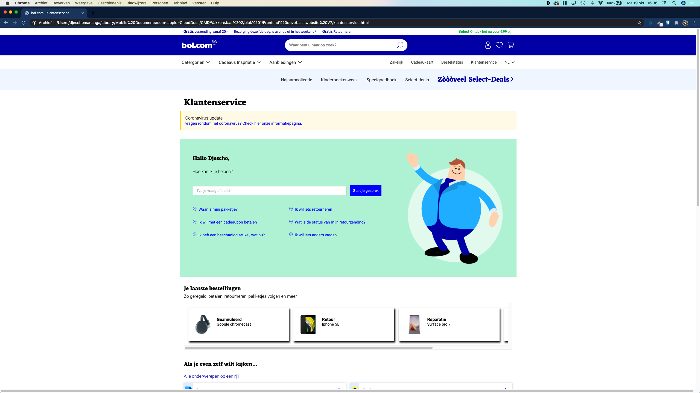 
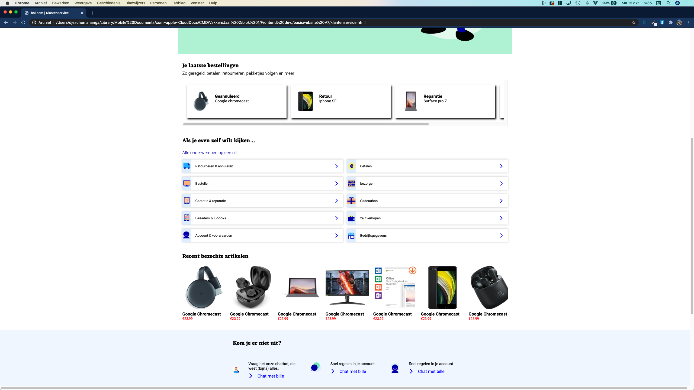  

  

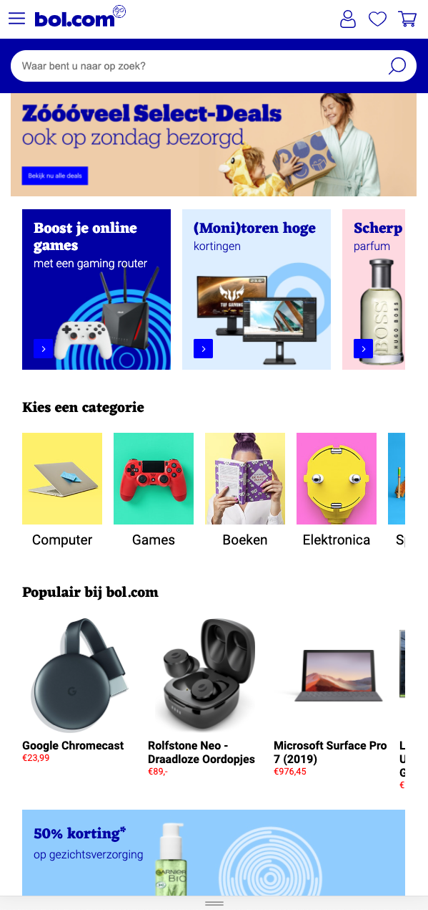
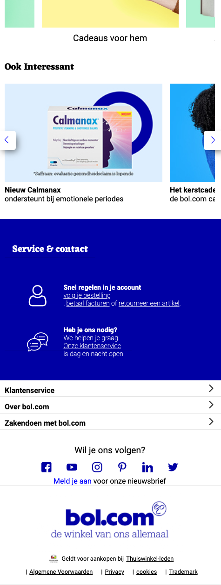

## Voortgang 3 (week 6)

### Stand van zaken

Wat ik zo leuk vind is dat ik in dit project steeds vaker mijn eigen probelemen kan localiseren en oplossen. Inmiddels heb ik de header volledig responsive gekregen en stopt de pagina met groeien na width: 77em. Nu moet ik alleen het blauw van de service sectie nog de volledige breedte van het scherm laten aannemen. Deze week wil ik deze pagina helemaal af hebben, de html en css herzien en aan de product pagina starten.

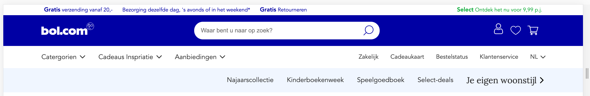
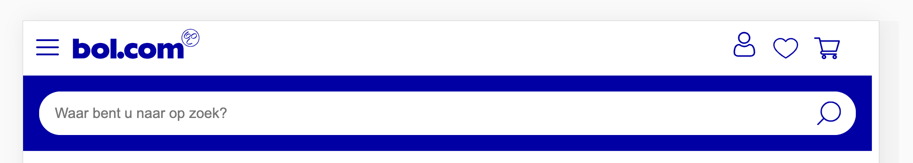

### Agenda voor meeting

| Transitie in elkaar vouwen van header en main over de hero (header begint transparant en verkleurd bij het "vouwen") | Ik krijg de scroll knoppen maar niet werkende :) | Wat kan ik toevoegen om aan de surface plane te voldoen, want overal animaties bij maakt het niet beter |
| Timing tekst animaties (inschuiven vanaf de zijkant tijdens het scrollen) |  |  |
| Tekst op een makkelijke manier responsive uitlijnen |  |  |
| First class is free section met meebewegende (achtergrond?) afbeelding |  |  |
| Afbeelding correct uitknippen / plaatsen op basis van schermgrootte |  |  |

## Voortgang 2 (week 5)

### Stand van zaken

De site staat er inmiddels. Op hemt moment ben ik bezig met het verbeteren van stukken html/css en het responsive maken van de website. Vaak zie ik achteraf dat het veel beter en netter kan en dan moet ik vaak een heel blok opnieuw uitwerken. Dit is altijd een uitdaging. Ik merk dat ik CSS grid steeds stapje bij stapje beter begin te begrijpen. Door zelf wat test bestandjes te maken ben ik al een stuk verder gekomen in mijn kennis. 

**screenshots(s)**

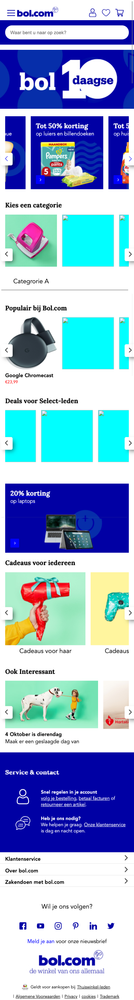

### Agenda voor meeting

| Celine | Djescho | Floris |
|--------|:-------:|-------:|
| Responsiveness afbeeldingsgrootte | Hoeveel animatie moet er in zitten als je responsive hebt gekozen | |
| Zoekbalk 'pop-up' | Max width opgelost met flexbox, is this the way? | Items in een gradient op hun plek laten bij responsive |
| Tekst op een makkelijke manier responsive uitlijnen |  |  |
| Responsiveness van hamburger menu icoon naar menu-items naast elkaar uigelijnd in navigatiebalk |  |  |
| Timing tekst animaties |  |  |
| First class is free section met meebewegende (achtergrond/overlay?) afbeelding  | | |

#### Verslag van meeting

Na de hulp van sanne kon iedereen weer verder.

## Voortgang 1 (week 3)

### Stand van zaken

Ik ben ontzettend blij dat ik de bol.com website heb uitgekozen voor deze opdracht. Ik vind het een ontzettend leuke uidaging om aan te gaan. Wat de bol.com site uniek maakt is dat de site ontzettend veel horizontaal scrollende velden heeft. Dit was een ontzettende uitdaging: hoe plaats je de navigatie pijlen?, hoe zorg je er voor dat tekst en afbeelding netjes bovenelkaar blijven staan? Dit waren allemaal vragen waarvoor ik het antwoord moest opzoeken. Na veel getest en nieuwe code heb ik het bij sectie 2 erg netjes gedaan.
Het leukste vind ik het netjes maken van mijn HTML/CSS. Ik vind het een hele leuke uidaging om mijn HTML en CSS zo goed mogelijk te optimaliseren door bijvoorbeeld: globale classes op te stellen, css selectoren te gebruiken en speciale afbeeldingen (zoals iconen) een speciale class te geven.

**Screenshot(s):**

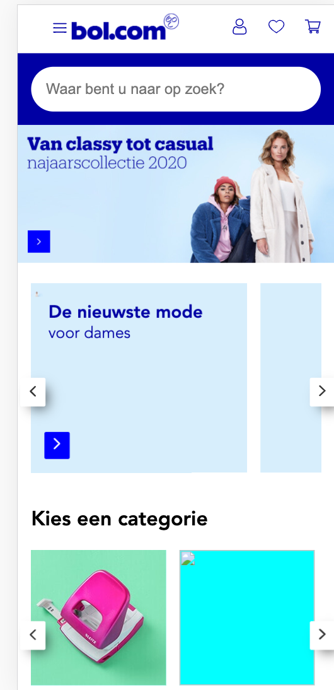

#### Agenda voor meeting

Agenda 17/8
Celine, Floris en Djescho

Dingen die we behandeld willen hebben:

- Responsive design (breakpoint) [Djescho]
- Scrollen met javascricpt [Djescho]
- Main en header vouwen inelkaar over de hero heen [Celine]
- Afbeeldingen in CSS [Floris en Djescho]
- wel goed doen [Djescho]
- Lege plek [Floris]

#### Verslag van meeting

Na de hulp van sanne kon iedereen weer verder.

## Intake (week 1)

**Je startniveau:** Rood. Ik vind programmeren erg leuk en ik begrijp het ook meestal snel.

**Je focus:** Responsive. Ik vind dit nog een uitdaging bij het bouwen van websites dus ik denk dat dit een goede keuze is.

**Je opdracht:** https://www.bol.com/nl/

**Screenshot(s):**

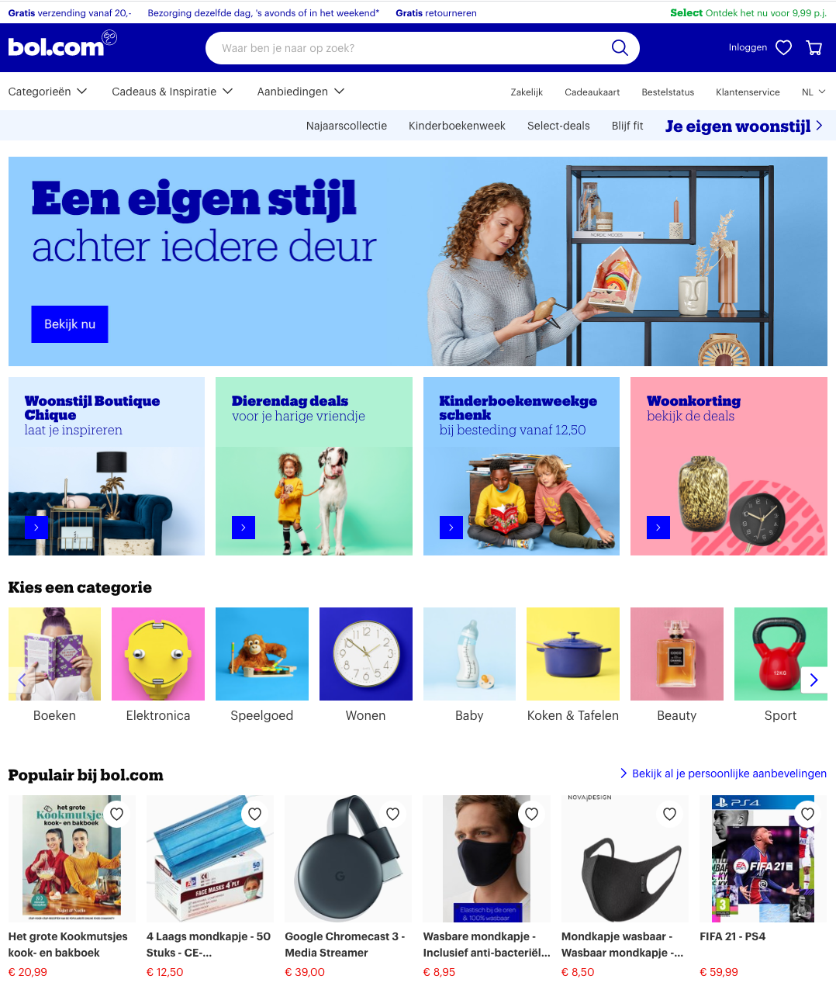

**Breakdown-schets(en):**

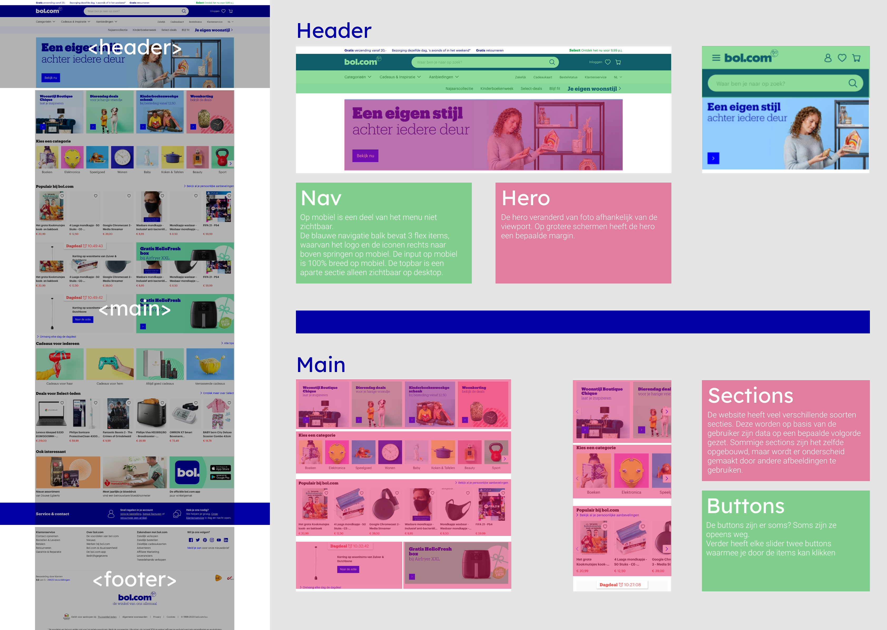
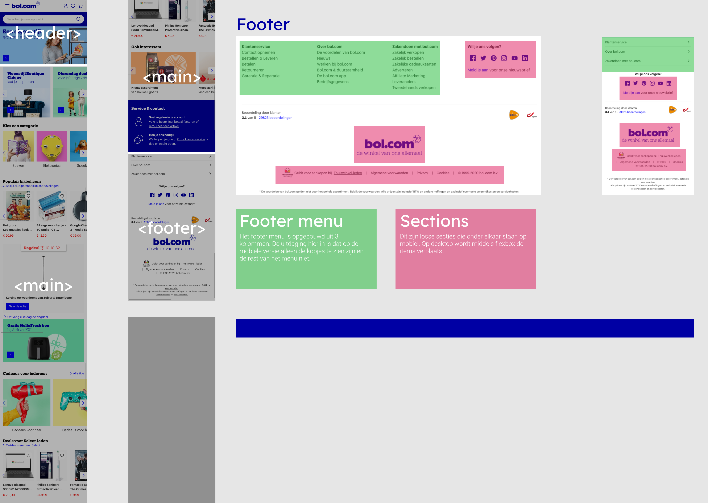
De pdf versies van deze foto's zijn [Hier](./docs/siteAnalyse/pdf/siteAnalyse.pdf) te zien.
