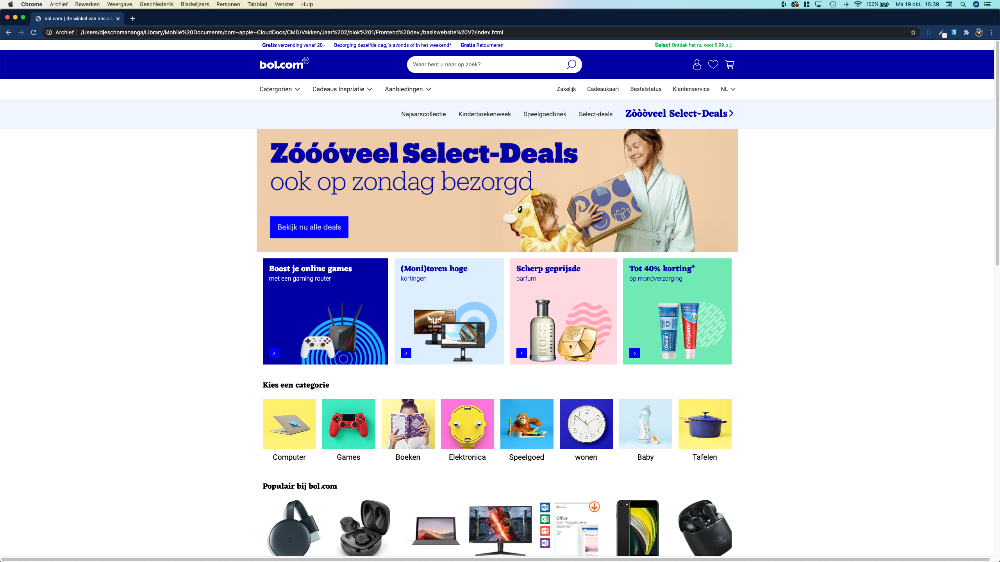
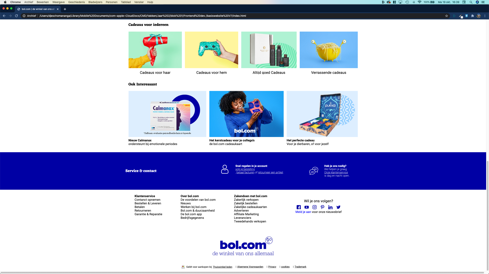

# Procesverslag
**Auteur: Djescho**

Markdown cheat cheet: [Hulp bij het schrijven van Markdown](https://github.com/adam-p/markdown-here/wiki/Markdown-Cheatsheet). Nb. de standaardstructuur en de spartaanse opmaak zijn helemaal prima. Het gaat om de inhoud van je procesverslag. Besteedt de tijd voor pracht en praal aan je website.

## Bronnenlijst
1. -Iconen van https://www.flaticon.com/-
2. -Producten van https://www.bol.com/-
3. -bol.com logo van https://pers.bol.com/beeld-archief-item/bol-com-logo/-

## Eindgesprek (week 7/8)

De laadste loodsjes wogen voor mij het zwaarst. Ik kwam er vrij last-minute achter dat er nog best wel wat bugs in de site zaten, die me niet waren opgevallen en die niet zomaar 1,2,3 waren opgelost.
Dit was dan ook soms erg frustrerend. svg's zijn een nachtmerrie om mee te werken dus soms staan er svg's in een img tag. Nu beide pagin's af zijn mag het eindresultaat er wel wezen. Mijn site en de echte bol.com site lijken heel erg veel op elkaar (wat soms ook voor verwarring zorgde).
de site is 100%responsice vanaf 320px.
Nu de site af is heb ga ik de volgende keer de analyse anders aanpakken.
Ik heb nu per sectie gewerkt, maar niet gekeken naar de overeenkomsten bonnenn de secties. Hierdoor is de css erg lang, vaak herhalend en soms inconsistent. Door een beter analyse te maken de volgene keer hoop ik een stuk minder individuele classes en id's nodig te hebben. Zo zou ik de volgende keer een speciale class maken voor scrollbare lijsten. Ook zou ik nog een keer gaan kijken naar de heading indeling van de pagina's.

Ik heb dit vak als ontzettend leerzaam ervaten. Ik heb het gevoel dat ik een stuk meer weet, en mijn kennis beter kan toepassen. Ook ik heb nu een klein schetsboekje.

**Screenshot(s):**

## Voortgang 3 (week 6)

### Stand van zaken

Wat ik zo leuk vind is dat ik in dit project steeds vaker mijn eigen probelemen kan localiseren en oplossen. Inmiddels heb ik de header volledig responsive gekregen en stopt de pagina met groeien na width: 77em. Nu moet ik alleen het blauw van de service sectie nog de volledige breedte van het scherm laten aannemen. Deze week wil ik deze pagina helemaal af hebben, de html en css herzien en aan de product pagina starten.

### Agenda voor meeting

## Voortgang 2 (week 5)

### Stand van zaken

De site staat er inmiddels. Op hemt moment ben ik bezig met het verbeteren van stukken html/css en het responsive maken van de website. Vaak zie ik achteraf dat het veel beter en netter kan en dan moet ik vaak een heel blok opnieuw uitwerken. Dit is altijd een uitdaging. Ik merk dat ik CSS grid steeds stapje bij stapje beter begin te begrijpen. Door zelf wat test bestandjes te maken ben ik al een stuk verder gekomen in mijn kennis. 

**screenshots(s)**

### Agenda voor meeting

| Celine | Djescho | Floris |
|--------|:-------:|-------:|
| Transitie in elkaar vouwen van header en main over de hero (header begint transparant en verkleurd bij het "vouwen") | Ik krijg de scroll knoppen maar niet werkende :) | Wat kan ik toevoegen om aan de surface plane te voldoen, want overal animaties bij maakt het niet beter |
| Timing tekst animaties (inschuiven vanaf de zijkant tijdens het scrollen) |  |  |
| Tekst op een makkelijke manier responsive uitlijnen |  |  |
| First class is free section met meebewegende (achtergrond?) afbeelding |  |  |
| Afbeelding correct uitknippen / plaatsen op basis van schermgrootte |  |  |

## Voortgang 1 (week 3)

### Stand van zaken

Ik ben ontzettend blij dat ik de bol.com website heb uitgekozen voor deze opdracht. Ik vind het een ontzettend leuke uidaging om aan te gaan. Wat de bol.com site uniek maakt is dat de site ontzettend veel horizontaal scrollende velden heeft. Dit was een ontzettende uitdaging: hoe plaats je de navigatie pijlen?, hoe zorg je er voor dat tekst en afbeelding netjes bovenelkaar blijven staan? Dit waren allemaal vragen waarvoor ik het antwoord moest opzoeken. Na veel getest en nieuwe code heb ik het bij sectie 2 erg netjes gedaan.
Het leukste vind ik het netjes maken van mijn HTML/CSS. Ik vind het een hele leuke uidaging om mijn HTML en CSS zo goed mogelijk te optimaliseren door bijvoorbeeld: globale classes op te stellen, css selectoren te gebruiken en speciale afbeeldingen (zoals iconen) een speciale class te geven.

**Screenshot(s):**

#### Agenda voor meeting

Agenda 17/8
Celine, Floris en Djescho

Dingen die we behandeld willen hebben:

- Responsive design (breakpoint) [Djescho]
- Scrollen met javascricpt [Djescho]
- Main en header vouwen inelkaar over de hero heen [Celine]
- Afbeeldingen in CSS [Floris en Djescho]
- wel goed doen [Djescho]
- Lege plek [Floris]

#### Verslag van meeting

Na de hulp van sanne kon iedereen weer verder.

## Intake (week 1)

**Je startniveau:** Rood. Ik vind programmeren erg leuk en ik begrijp het ook meestal snel.

**Je focus:** Responsive. Ik vind dit nog een uitdaging bij het bouwen van websites dus ik denk dat dit een goede keuze is.

**Je opdracht:** https://www.bol.com/nl/

**Screenshot(s):**

**Breakdown-schets(en):**

De pdf versies van deze foto's zijn [Hier](./docs/siteAnalyse/pdf/siteAnalyse.pdf) te zien.
